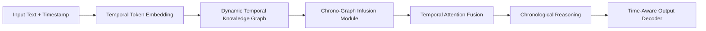

# Chronological Knowledge Graph Infusion for Time-Aware Natural Language Understanding

This project explores a time-aware NLP pipeline that combines contextual text embeddings, temporal encodings, and a dynamic knowledge graph for news classification. The goal is to improve natural language understanding by injecting chronological structure into the model, so predictions can use both semantic context and time-sensitive relational context.

The current implementation is built as a single end-to-end script in [main.py](main.py), with an equivalent notebook version in [main.ipynb](main.ipynb).

## Project Topic

**Chronological Knowledge Graph Infusion for Time-Aware Natural Language Understanding**

The model is designed around the idea that language understanding often depends on temporal context:

- the same entity can mean different things in different years
- relationships between entities evolve over time
- time-sensitive topics such as politics, trade, sports, and science can benefit from chronological reasoning

## Architecture

The implemented pipeline follows this sequence:

1. Input Text + Timestamp
2. Temporal Token Embedding
3. Dynamic Temporal Knowledge Graph
4. Graph Embedding Injector (Chrono-Graph Infusion Module)
5. Temporal Attention Transformer Layers
6. Chronological Reasoning Module
7. Time-Aware Output Decoder



## Implementation Summary

This implementation uses the `AG News` dataset and maps each sample into a temporally enriched representation:

- text embeddings come from `bert-base-uncased`
- named entities are extracted with `spaCy`
- a temporal graph is built from entity co-occurrence plus label-conditioned relations
- graph structure is embedded with `Node2Vec`
- temporal information is encoded with sinusoidal time encoding and era-based chronological features
- text, graph, and temporal signals are fused with a temporal attention module
- a final neural decoder performs 4-class classification: `world`, `sports`, `business`, `scitech`

## Features

- Temporal-aware text representation using year-prefixed inputs
- Dynamic knowledge graph built from extracted entities and time-stamped relations
- Node2Vec-based graph embedding infusion
- Temporal attention fusion layer for combining text, time, and graph signals
- Chronological feature engineering with era and normalized year encoding
- Reproducible training setup with fixed seeds
- Inference-time ambiguity handling for borderline political vs science/tech examples

## Results

### Latest Verified Local Run

The following results were obtained from a full terminal run of the current [main.py](main.py):

| Model | Accuracy |
| --- | ---: |
| Baseline Temporal Decoder | 0.9033 |
| Attention Fusion Model | 0.8967 |

### Attention Fusion Classification Report

| Class | Precision | Recall | F1-score |
| --- | ---: | ---: | ---: |
| business | 0.79 | 0.91 | 0.85 |
| scitech | 0.90 | 0.83 | 0.86 |
| sports | 0.98 | 0.97 | 0.98 |
| world | 0.93 | 0.88 | 0.90 |

### Example Predictions

```text
Text: Apple released a new iPhone in 2023 with advanced AI features.
Prediction: scitech (0.9414)

Text: The stock market crashed after major economic announcements.
Prediction: business (0.9705)

Text: The team won the championship after a thrilling match.
Prediction: sports (0.9878)

Text: The United Nations held a political meeting on global climate policies.
Prediction: world (0.5218)

Text: Google unveiled a new quantum computing breakthrough in 2024.
Prediction: scitech (0.9322)
```

## Repository Structure

```text
.
├── main.py
├── main.ipynb
├── README.md
├── requirements.txt
└── setup_venv.sh
```

## Environment Setup

### Recommended

Use the provided setup script:

```bash
bash setup_venv.sh
source nlp_env/bin/activate
```

This script:

- creates the virtual environment if it does not already exist
- installs pinned dependencies
- downloads the `en_core_web_sm` spaCy model

### Manual Setup

```bash
python3 -m venv nlp_env
source nlp_env/bin/activate
python -m pip install --upgrade "pip<25" "setuptools<82" wheel
python -m pip install -r requirements.txt
python -m spacy download en_core_web_sm
```

## Running the Project

```bash
source nlp_env/bin/activate
python main.py
```

## Important Notes

- The first run downloads the `AG News` dataset and `bert-base-uncased` from Hugging Face.
- Internet access is required for the first setup and first model/data download.
- The repository should not include the local `nlp_env` folder when pushing to GitHub.
- This project is currently packaged as a single-script research prototype rather than a modular production codebase.

## Future Improvements

- split the monolithic script into reusable modules
- save trained checkpoints and reuse them for inference
- add a proper evaluation script separate from training
- expose the model through a lightweight API or demo UI
- compare against more temporal benchmarks beyond AG News
